# ATOM as a Plugin Backend for vLLM: Bridging Hardware Optimization with Framework Ecosystem

## Introduction

Large Language Model (LLM) inference is a rapidly evolving domain where the tension between **hardware-specific optimization** and **framework compatibility** is a constant challenge. On one hand, squeezing maximum performance from accelerators like AMD Instinct GPUs demands deep, hardware-aware kernel engineering. On the other hand, production deployments overwhelmingly rely on established serving frameworks — particularly [vLLM](https://github.com/vllm-project/vllm) — for their battle-tested scheduling, memory management, and API compatibility.

ATOM, a high-performance inference engine purpose-built for AMD Instinct GPUs, addresses this tension through a dual-mode architecture. In addition to operating as a standalone server, ATOM can seamlessly integrate into vLLM as an **Out-of-Tree (OOT) Plugin Backend**, delivering AMD-specific model and kernel optimizations without requiring any code changes to vLLM itself.

### The Goal: Ecosystem Co-Evolution, Not Competition

The ATOM vLLM plugin is **not** a fork or a replacement — it is designed as a **collaborative bridge** between AMD's hardware innovation cycle and the open-source vLLM ecosystem. The core philosophy is **win-win co-evolution**.

vLLM has become the **de facto standard** for LLM serving in the industry. From startups to hyperscalers, teams across the world have built their inference infrastructure around vLLM's API, its continuous batching scheduler, and its operational tooling. Users are deeply familiar with vLLM's deployment workflow — `vllm serve`, OpenAI-compatible endpoints, tensor parallelism flags — and switching to a different serving framework introduces significant learning cost, migration risk, and operational overhead. **Users should not have to choose between the framework they know and the hardware performance they need.**

By integrating ATOM as a plugin into vLLM, we achieve a true win-win:

- **Zero learning cost for users.** Users continue to use the exact same vLLM commands, APIs, and deployment patterns they already know. ATOM activates transparently — no new CLI, no new configuration format, no new monitoring stack. The user experience is identical; only the underlying kernel performance improves.

- **Early access to AMD's latest hardware and software.** Through the plugin, users can immediately benefit from AMD's newest hardware features (FP4 on MI355X, rack-scale inference on MI400) and latest kernel optimizations (AITER's fused attention, custom AllReduce) — without waiting for these to be upstreamed into vLLM's mainline. This dramatically shortens the time-to-value for new AMD silicon.

- **ATOM as the POC (Proof of Concept) layer.** ATOM serves as the fast-moving proving ground where new ideas are incubated, new AMD hardware features are brought up, and new kernel libraries (such as AITER) are integrated and validated. It operates with the agility needed to keep pace with AMD's silicon roadmap — new GPU launches, new precision formats (FP8, FP4), new attention mechanisms — without being constrained by upstream release cycles.

- **vLLM as the production-grade product for the ROCm platform.** vLLM is the community-standard serving framework and the primary production-level product for AMD ROCm users. It provides the stability, broad model coverage, and enterprise-grade features that production deployments demand.

- **Upstream everything once mature.** The ATOM plugin is explicitly designed as a **temporary home** for optimizations. Once a new kernel, a new model optimization, or a new hardware feature has been validated and stabilized through ATOM's plugin mode, the goal is to **upstream all of these improvements into vLLM's native ROCm backend**. This ensures the broader community benefits, and vLLM's ROCm support continuously improves.

In concrete terms, the ATOM plugin lifecycle looks like this:

1. **New hardware launch** (e.g., MI355X with native FP4, MI400 with rack-scale interconnect) → ATOM rapidly integrates AITER kernels, brings up new hardware features such as rack-scale distributed inference, and validates end-to-end performance via the plugin.
2. **New idea incubation** (e.g., fused QK-RoPE-Cache-Update for MLA) → ATOM implements and benchmarks the optimization in plugin mode, iterating quickly without upstream dependencies.
3. **New library integration** (e.g., AITER's MLA decode kernel, custom AllReduce) → ATOM integrates the library through the plugin, proving its value in real serving workloads.
4. **Maturity → Upstream** → Once validated, the optimization is contributed back to vLLM's native codebase, becoming available to all ROCm users without requiring ATOM.

This approach ensures that AMD's hardware advantages reach users as fast as possible through ATOM, while the long-term investment flows back into the open-source ecosystem through vLLM.

This post dives into the design, architecture, and implementation details of the ATOM vLLM plugin system.

## Motivation: Why a Plugin Architecture?

The LLM inference ecosystem faces a fundamental dilemma:

- **Framework teams** (e.g., vLLM) focus on scheduling, batching, memory management, and API surfaces. They must support multiple hardware backends and cannot deeply optimize for any single one.
- **Hardware teams** (e.g., AMD) have intimate knowledge of their silicon — custom kernels, memory hierarchies, precision formats — but rewriting an entire serving framework is neither practical nor maintainable.

vLLM recognized this early and introduced a mature **plugin registration mechanism**. Multiple accelerator vendors have already leveraged this design to register their devices and optimizations into vLLM without forking the upstream codebase. ATOM follows this established pattern, providing a clean separation of concerns:

| Layer | Responsibility |
|-------|---------------|
| **vLLM** | Request scheduling, KV cache management, continuous batching, OpenAI-compatible API |
| **ATOM Plugin** | Platform registration, model implementation, attention backends, kernel-level optimization |
| **AITER** | Low-level GPU kernels — fused MoE, flash attention, quantized GEMM, RoPE fusion |

This layered approach means **end users change nothing** — they launch `vllm serve` exactly as before. ATOM activates automatically via Python entry points.

## Architecture Overview

The ATOM vLLM plugin system consists of four interconnected subsystems:

```
┌─────────────────────────────────────────────────────────┐
│                    vLLM Framework                        │
│  (Scheduling, Batching, KV Cache, API, CUDAGraph)       │
├─────────────────────────────────────────────────────────┤
│                  ATOM Plugin Layer                        │
│  ┌──────────────┐ ┌──────────────┐ ┌──────────────────┐ │
│  │   Platform    │ │    Model     │ │    Attention      │ │
│  │  Registration │ │  Registration│ │    Backend        │ │
│  │  (ATOMPlatform│ │  (Wrapper)   │ │  (MHA + MLA)     │ │
│  └──────┬───────┘ └──────┬───────┘ └────────┬─────────┘ │
├─────────┼────────────────┼──────────────────┼───────────┤
│         │     ATOM Core  │                  │            │
│  ┌──────┴───────┐ ┌──────┴───────┐ ┌───────┴──────────┐ │
│  │   Config     │ │    Model     │ │   Model Ops      │ │
│  │  Translation │ │   Impl       │ │   (PagedAttn,    │ │
│  │              │ │  (Qwen, DS)  │ │    MLA, Linear)  │ │
│  └──────────────┘ └──────────────┘ └──────────────────┘ │
├─────────────────────────────────────────────────────────┤
│                    AITER Kernel Library                   │
│  (FlashAttn, FusedMoE, MLA Decode, Quantized GEMM,      │
│   RoPE+Cache Fusion, Custom AllReduce)                   │
└─────────────────────────────────────────────────────────┘
```

The following diagram illustrates the end-to-end execution flow — from `vllm serve` startup through OOT plugin discovery, model construction, and a single serving step — showing how vLLM and ATOM interact at each stage:



As shown in the diagram, the execution flow has four phases: **plugin discovery** (steps 1–5), **attention backend selection** (steps 6–7), **model construction** (steps 8–9), and **serving** (steps 10–11). The subsections below cover the key implementation details of each phase.

### 1. Entry Point Registration (Steps 1–5)

The plugin activates through Python's standard `entry_points` mechanism:

```toml
[project.entry-points."vllm.platform_plugins"]
atom = "atom.plugin.vllm.register:register_platform"

[project.entry-points."vllm.general_plugins"]
atom_model_registry = "atom.plugin.vllm.register:register_model"
```

`register_platform()` returns the `ATOMPlatform` class (step 3); `register_model()` overrides vLLM's model registry with ATOM's optimized wrappers (step 5). Both hooks are no-ops when `ATOM_DISABLE_VLLM_PLUGIN=1` is set.

### 2. Attention Backend Selection (Steps 6–7)

`ATOMPlatform` extends `RocmPlatform` and overrides `get_attn_backend_cls()` to route attention to AITER-backed implementations:

```python
class ATOMPlatform(RocmPlatform):
    @classmethod
    def get_attn_backend_cls(cls, selected_backend, attn_selector_config, num_heads):
        if attn_selector_config.use_mla:
            return "atom.model_ops.attentions.aiter_mla.AiterMLABackend"
        return "atom.model_ops.attentions.aiter_attention.AiterBackend"
```

- **AiterBackend (MHA)** — Translates vLLM's `CommonAttentionMetadata` into a three-phase format (decode / extend / prefill) with chunk-based context processing.
- **AiterMLABackend (MLA)** — For DeepSeek V2/V3-style latent attention, with fused QK-RoPE-Cache-Update, batched FP4/FP8 GEMM for V-projection, persistent metadata buffers for CUDAGraph, and distributed context parallelism. ATOM patches vLLM's `MLAAttention.forward_impl` at import time to delegate to its own implementation when the plugin is active.

### 3. Model Construction and Weight Loading (Steps 8–9)

The `ATOMModelBase` wrapper implements vLLM's model interface while delegating to ATOM's native models. It handles:

- **Config translation** — `VllmConfig` → ATOM `Config`, preserving CUDAGraph settings while applying ATOM's own compile policies.
- **Model construction** — Instantiates the ATOM model class and initializes AITER's distributed backend.
- **Weight loading** — Uses ATOM's `load_model_in_plugin_mode()` for ATOM-specific formats and quantization schemes.

## Key Design Decisions

### Decorator-Based Class Transformation

One of the most interesting patterns in the codebase is the use of **decorator-based class transformation** for attention metadata builders. Rather than using traditional inheritance, ATOM dynamically reconstructs classes at decoration time:

```python
@AiterAttentionMetadataBuilderDecoratorForPluginMode(default_base_class)
class AiterAttentionMetadataBuilder:
    ...
```

The decorator:
1. Extracts the decorated class's methods.
2. Determines the correct base class for the vLLM framework.
3. Injects vLLM-specific `__init__`, `build()`, and `build_for_cudagraph_capture()` methods.
4. Creates a new class with the correct inheritance chain.

This approach cleanly separates ATOM's core model logic from vLLM's attention metadata interface, with the framework-specific behavior resolved at import time rather than runtime.

### Graceful Degradation

Every component supports graceful fallback:

- `ATOM_DISABLE_VLLM_PLUGIN=1` — Disables the entire plugin; vLLM runs as if ATOM isn't installed.
- `ATOM_DISABLE_VLLM_PLUGIN_ATTENTION=1` — Uses ATOM's model implementations but falls back to vLLM's native attention backends.

This granularity is essential for debugging and A/B performance comparison.

## Performance Characteristics

The plugin architecture enables several performance advantages over pure vLLM:

1. **Kernel-Level Fusion** — ATOM's models leverage AITER kernels that fuse operations like QK-norm + RoPE + cache update + quantization into single kernel launches, reducing memory bandwidth pressure.

2. **Optimized MoE Scheduling** — For Mixture-of-Experts models (Qwen3-MoE, DeepSeek V3, GPT-OSS), ATOM provides specialized expert parallel implementations with custom collective operations via AITER's distributed backend.

3. **Precision Optimization** — Native FP8 and FP4 (MXFP4) support through AITER's quantized GEMM kernels, including batched variants for MLA's V-projection.

4. **CUDAGraph Compatibility** — The metadata builder's `build_for_cudagraph_capture()` method ensures that ATOM's attention backends work correctly with vLLM's CUDAGraph capture, maintaining the latency benefits of graph-based execution.

Accuracy validation on GSM8K with Qwen3-235B-A22B confirms that the plugin maintains model quality:

| Metric | Value |
|--------|-------|
| flexible-extract (3-shot) | 0.9037 ± 0.0081 |
| strict-match (3-shot) | 0.8832 ± 0.0088 |

## Getting Started

### Prerequisites

- AMD Instinct GPU (MI300X / MI355X)
- vLLM ROCm Docker image
- AITER kernel library (latest main branch)

### Installation

```bash
# Pull vLLM ROCm docker
docker pull rocm/vllm-dev:nightly_main_20260118

# Install ATOM (activates plugin automatically via entry points)
git clone https://github.com/ROCm/ATOM.git
cd ATOM
pip install -e .

# Install dependencies
pip install --upgrade triton
pip install transformers==5.0.0
pip install git+https://github.com/foundation-model-stack/fastsafetensors.git
```

### Launch

No special arguments needed — ATOM activates automatically:

```bash
vllm serve /path/to/model \
    --tensor-parallel-size 8 \
    --enable-expert-parallel \
    --kv-cache-dtype fp8 \
    --max-num-batched-tokens 18432 \
    --max-model-len 16384
```

## Supported Models

| Architecture | Type | Representative Models | ATOM Model Class |
|-------------|------|----------------------|-----------------|
| Qwen3ForCausalLM | Dense | Qwen3-8B, Qwen3-32B | `atom.models.qwen3` |
| Qwen3MoeForCausalLM | MoE | Qwen3-235B-A22B | `atom.models.qwen3_moe` |
| DeepseekV3ForCausalLM | MoE (MLA) | DeepSeek-V3, DeepSeek-R1, Kimi-K2-Thinking | `atom.models.deepseek_v2` |
| GptOssForCausalLM | MoE | GPT-OSS | `atom.models.gpt_oss` |
| Glm4MoeForCausalLM | MoE | GLM-4-MoE | `atom.models.glm4_moe` |

## Conclusion

The ATOM vLLM plugin demonstrates that hardware-specific optimization and framework compatibility are not mutually exclusive. By leveraging vLLM's OOT plugin mechanism, ATOM delivers AMD-specific kernel optimizations — fused attention, quantized GEMM, optimized MoE routing — while preserving the full vLLM feature set that production deployments depend on.

The plugin architecture also serves as a proving ground: optimizations validated in ATOM's plugin mode can be upstreamed to vLLM's native ROCm backend over time, benefiting the broader community. Meanwhile, users get immediate access to the latest AMD hardware capabilities without waiting for upstream integration cycles.

For more details, see the [RFC on GitHub](https://github.com/ROCm/ATOM/issues/201) and the [ATOM repository](https://github.com/ROCm/ATOM).
